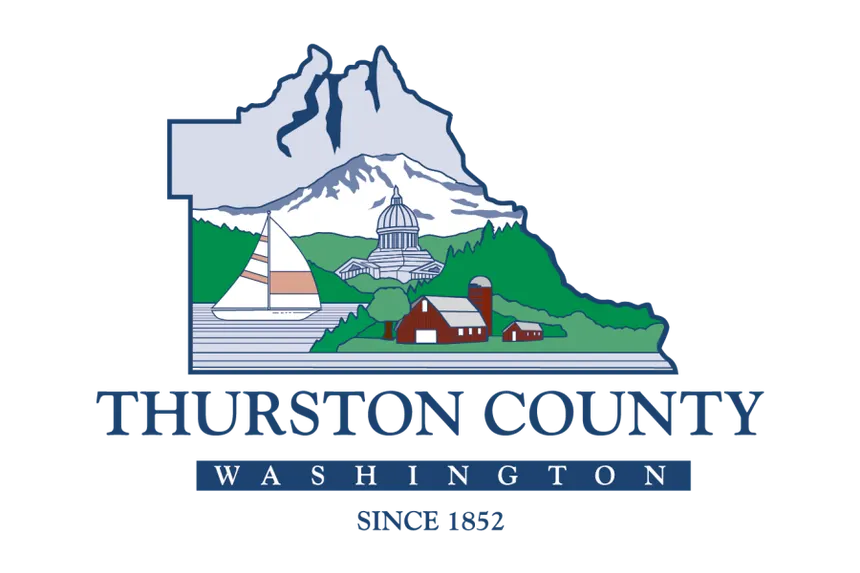

# Thurston County Permit Tracker



Permit tool for compliance and document management for contractors and homeowners in the Thurston County region of WA.

## Features

- Property Lookup + GIS Integration** → Eliminates critical areas confusion
- Smart Checklist Generator → Prevents incomplete application rejections
- Deadline Calculation Engine → Stops 180/365-day deadline disasters
- Multi-Jurisdiction Router → Handles County + 6 cities seamlessly
- Notification System → Proactive alerts before problems occur

## Technical Architecture:

- Scalable - PostgreSQL + Next.js allows rapid iteration then enterprise features
- MVP focuses on core deadline tracking (biggest pain point)
- Data-Driven - Built-in analytics to prove ROI to contractors
- Mobile-First - Contractors need field access to project status

## Database
Hosted with neon.tech and managed with PrismaORM.

- [Instance Link](https://console.neon.tech/app/projects/orange-art-65847270)

<details><summary>Prisma ORM Reference</summary>

  ### Prisma Migration Quick Reference

  #### Essential Commands

  ```bash
  # Create and apply migration
  npx prisma migrate dev --name <migration-name>

  # Apply pending migrations (production)
  npx prisma migrate deploy

  # Reset database (destroys all data)
  npx prisma migrate reset

  # Check migration status
  npx prisma migrate status
  ```

  #### Common Workflows

  **Initial Setup**
  ```bash
  npx prisma migrate dev --name init
  ```

  **Schema Changes**
  1. Edit `schema.prisma`
  2. `npx prisma migrate dev --name <description>`

  **Production Deploy**
  ```bash
  npx prisma migrate deploy
  ```

  #### Fix Drift Issues

  ```bash
  # Option 1: Reset (dev only)
  npx prisma migrate reset

  # Option 2: Mark as resolved
  npx prisma migrate resolve --applied <migration-name>

  # Option 3: Pull current schema
  npx prisma db pull
  ```

  #### Always After Migration
  ```bash
  npx prisma generate
  ```

</details>

## Frontend
Hosted with Netlify.

This is a [Next.js](https://nextjs.org) project bootstrapped with [`create-next-app`](https://nextjs.org/docs/app/api-reference/cli/create-next-app).

## Getting Started

First, run the development server:

```bash
npm run dev
# or
yarn dev
# or
pnpm dev
# or
bun dev
```

Open [http://localhost:3000](http://localhost:3000) with your browser to see the result.

You can start editing the page by modifying `app/page.tsx`. The page auto-updates as you edit the file.

This project uses [`next/font`](https://nextjs.org/docs/app/building-your-application/optimizing/fonts) to automatically optimize and load [Geist](https://vercel.com/font), a new font family for Vercel.

## Learn More

To learn more about Next.js, take a look at the following resources:

- [Next.js Documentation](https://nextjs.org/docs) - learn about Next.js features and API.
- [Learn Next.js](https://nextjs.org/learn) - an interactive Next.js tutorial.

You can check out [the Next.js GitHub repository](https://github.com/vercel/next.js) - your feedback and contributions are welcome!

